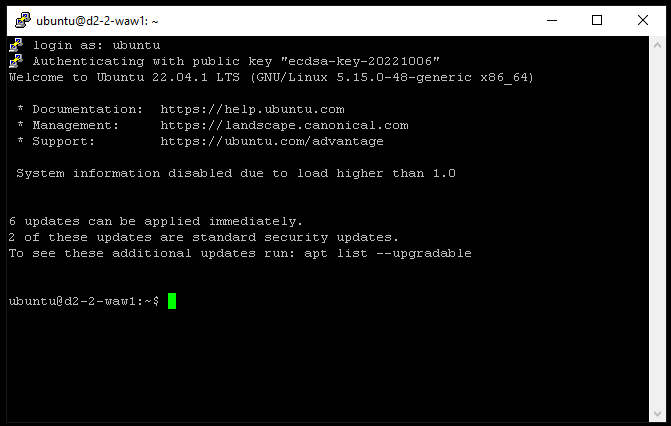

# Podstawowe operacje na maszynie wirtualnej

W tej sekcji uruchomimy nową maszynę wirtualną, zalogujemy się na nią i przeprowadzimy podstawowe operacje.

## 1. Utworzenie instancji z dockerem

W Managerze w sekcji **Compute** w karcie **Instances** klikamy przycisk *Utwórz instancję*.

W sekcji *wybierz model* wybieramy Discovery **D2-2** - instancja z publicznym IP, 1 CPU i 2GB RAM.

Lokalizacja, dowolna.

System operacyjny: **Ubuntu 22.04**

Wybieramy **klucz SSH**, który wcześniej dodaliśmy.

Konfiguracja instancji: w skrypcie poinstalacyjnym podajemy

```
#include https://get.docker.com/
```

Rozliczenie: **godzinowe**

## 2. Logowanie się do nowo utworzonej maszyny wirtualnej

=== "Linux, MacOS"
    Wykorzystamy klienta OpenSSH

    ```bash
    ssh -i ~/roadshow-workspace/key ubuntu@${IP}
    ```
    Na pytanie `The authenticity of host can't be established. Are you sure you want to continue connecting` odpowiadamy: `yes`

=== "Windows"
    Wykorzystamy program `putty.exe`

    W programie putty w sekcji session podajemy adres IP.
    

    W sekcji Connection -> SSH -> Auth podajemy ścieżkę do pliku z kluczem prywatnym `priv.ppk`.
    

    Na pytanie czy na pewno jest to host do którego chcemy się połączyć odpowiadamy *Accept*.
    

    Wpisujemy jakiego użytkownika chcemy użyć do logowania. W naszym przykładzie jest to `ubuntu`.
    

## 3. Sprawdzenie parametrów maszyny wirtualnej.  

Żeby sprawdzić podstawowe parametry maszyny wirtualnej użyjemy kilku podstawowych komend.

Aby wyświetlić ilość pamięci RAM:
```
free
```

Aby wyświetlić liczbę rdzeni procesora:
```
nproc
```

Aby wyświetlić urządzenia blokowe:
```
lsblk
```

## 4. Dodanie dodatkowego dysku do instancji

Dodatkowy dysk do instancji dodajemy przez Managera.

W sekcji **Storage** wchodzimy w zakładkę **Block storage** i klikamy przycisk **Create a volume**

Ze względu na ograniczenia geograficzne wybieramy tą samą lokalizację jak ta, w której znajdują się maszyny wirtualne.

Po utworzeniu klikamy trzy kropki po prawej stronie i wybieramy *Attach to instance*


Po podłączeniu jeszcze raz wykonujemy polecenie `lsblk`.

### Przygotowanie dysku w systemie Linux

Tak dodany dysk jest surowy więc tworzymy na nim:

* tablicę partycji:

```
sudo parted -s /dev/sdb mklabel gpt
```

* partycję:

```
sudo parted -s /dev/sdb mkpart data 0% 100%
```

* system plików:

```
sudo mkfs.ext4 /dev/sdb1
```

* zamontowanie dysku
```
sudo mount /dev/sdb1 /mnt
```

### Sprawdzenie wydajności dysku

Instalujemy oprogramowanie fio

```
sudo apt update
sudo apt -y install fio
```

Przechodzimy do katalogu `/mnt`
```
cd /mnt
```
Uruchamiamy krótki test fio:
```
sudo fio --name=test --bs=4k --ioengine=libaio --iodepth=4 --size=1g --direct=1 --runtime=30
```

### Uruchomienie kontenera docker z nginx

Aby uruchomić kontener z serwerem nginx i opublikować go na porcie 80 wykonujemy komendę:

```
sudo docker run -d -p 80:80 --name nginx nginx:latest
```
