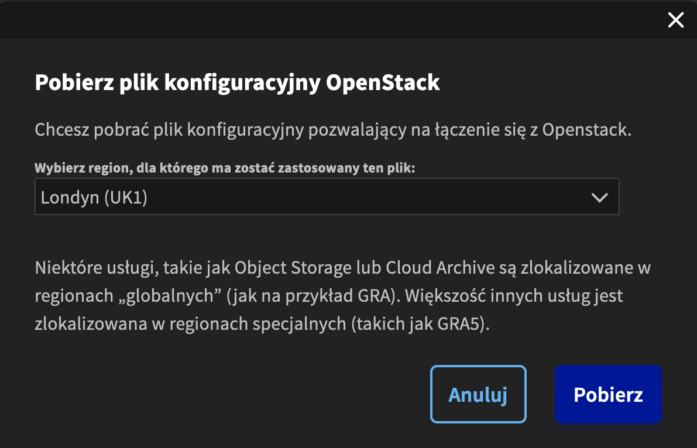
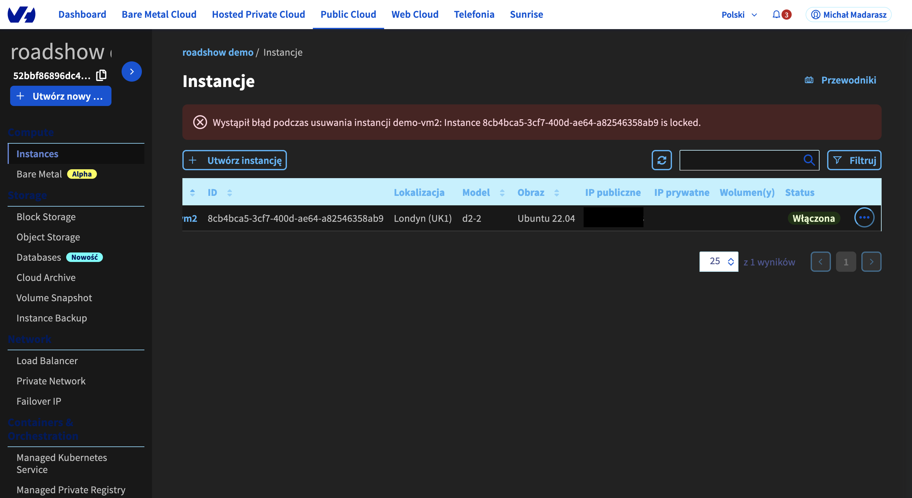

# Openstack CLI

!!! note
    Na tym etapie korzystamy z utworzonych instancji, żeby ułatwić sobie pracę.

## 1. Instalacja klienta Openstack
1. Logujemy się po SSH do instancji.
1. Na instancji wykonujemy polecenia:
```code
sudo apt update
sudo apt install -y python3-pip python3-dev
sudo pip3 install --upgrade pip
sudo pip3 install python-openstackclient
```

## 2. Użycie danych do logowania
1. Pobieramy plik RC OpenStack z panelu OVHcloud.


!!!warning
    Plik pobieramy dla regionu, gdzie istnieje nasza instancja. Na przykład:
    

1. Kopiujemy plik do instancji.

    === "Linux, MacOS"
        ```code
        scp -i ~/roadshow-workspace/key openrc ubuntu@<public_ip>:~/
        ```

    === "Windows"
        Kopiujemy zawartość pliku przy użyciu schowka do pliku ~/openrc na instancji.

1. Używamy pobranego pliku do połączenia się z OpenStack API.
```code
source openrc
```
1. Wywołanie poprzedniej komendy spowoduje uruchomienie prompta.
   Do logowania użyjemy hasła zapisanego podczas tworzenia użytkownika w panelu OVHcloud.

    

## 3. Zablokowanie instancji
1. Znajdujemy id naszej instancji przy użyciu:
```code
openstack server list
```
1. Przy pomocy komendy blokujemy operacje na instancji:
```code
openstack server lock <vm_id>
```
1. Upewniamy się, że maszyna wirtualna nie może zostać usunięta z poziomu panelu OVHcloud.

1. Zwalniamy blokadę dla wybranej instancji.
```code
openstack server unlock <vm_id>
```
1. Usuwamy instancję poprzez panel OVHcloud.
