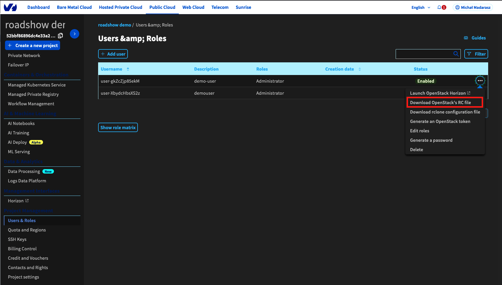
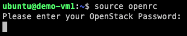

# Openstack CLI

!!! note
    Na tym etapie korzystamy z istniejących instancji, żeby ułatwić sobie pracę

## 1. Instalacja klienta Openstack
```code
sudo apt update
sudo apt install -y python3-pip python3-dev
sudo pip3 install --upgrade pip
sudo pip3 install python-openstackclient
```

## 2. Użycie danych do logowania
1. Pobranie pliku openrc.sh z panelu OVHcloud

1. Przekopiowanie pliku do instancji

    === "Linux, MacOS"
        ```code
        scp -i ~/roadshow-workspace/key openrc ubuntu@<public_ip>:~/
        ```

    === "Windows"
        Przekopiowanie zawartości do pliku ~/openrc na instancji

1. Użycie danych do logowania
```code
source openrc
```
1. Użycie hasła zapisanego podczas tworzenia użytkownika


## 3. Zablokowanie instancji
1. Komenda
```code
openstack server lock <vm_id>
```
1. Upewnienie się, że maszyna wirtualna nie może zostać usunięcia z poziomu panelu OVH
1. Zwolnienie blokady na wybranej instancji
```code
openstack server unlock <vm_id>
```
1. Usunięcie instancji poprzez panel OVH
