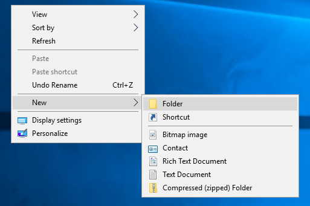
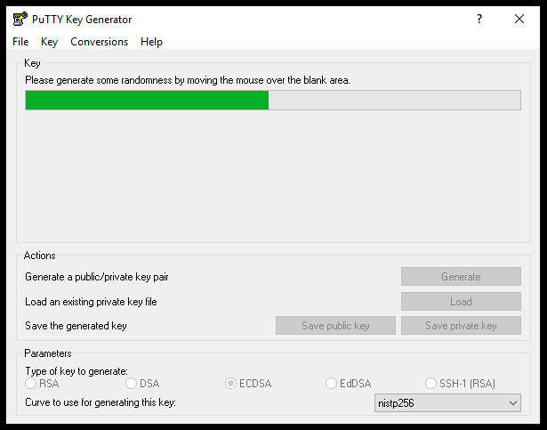
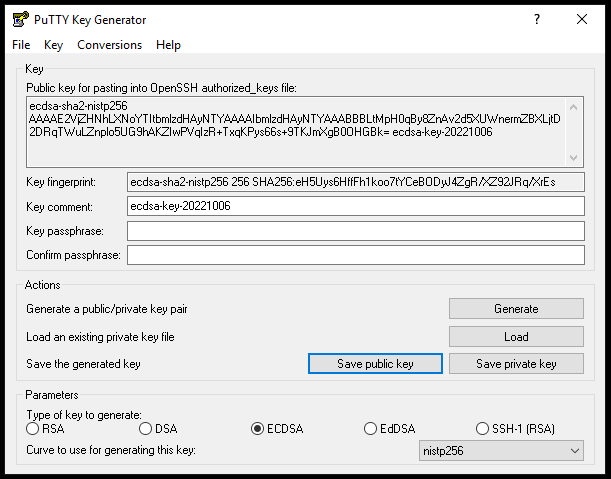
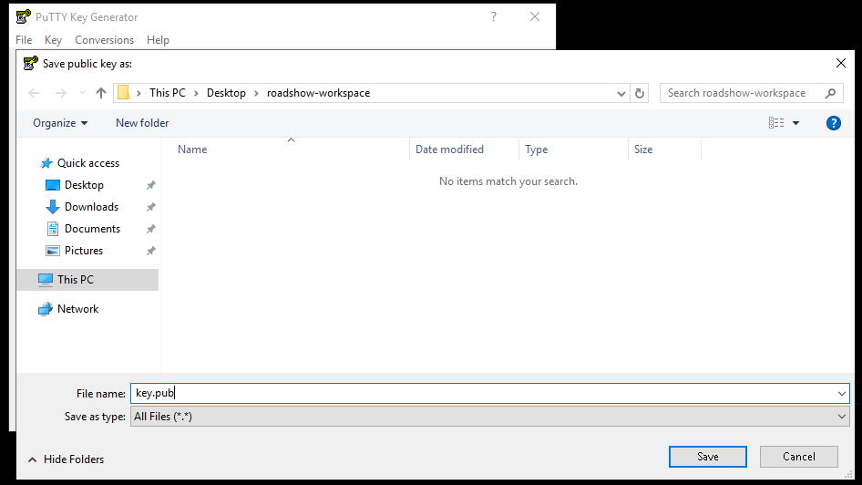
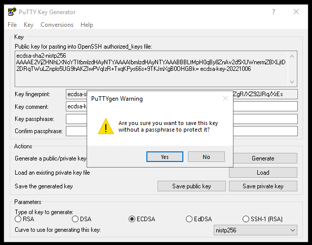
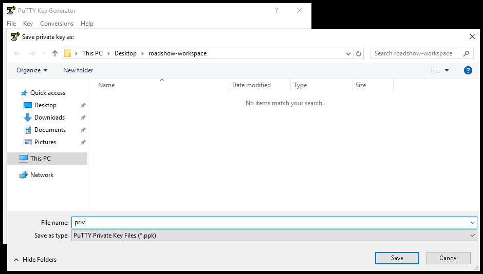
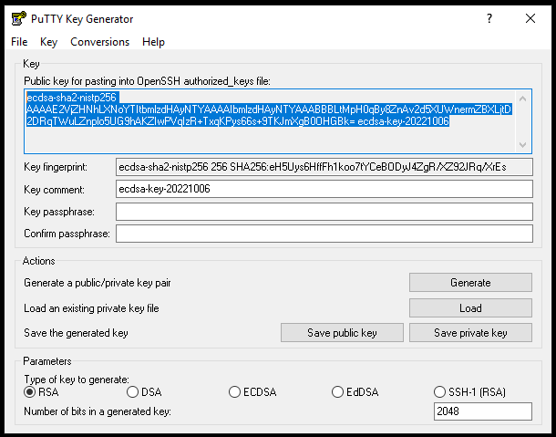
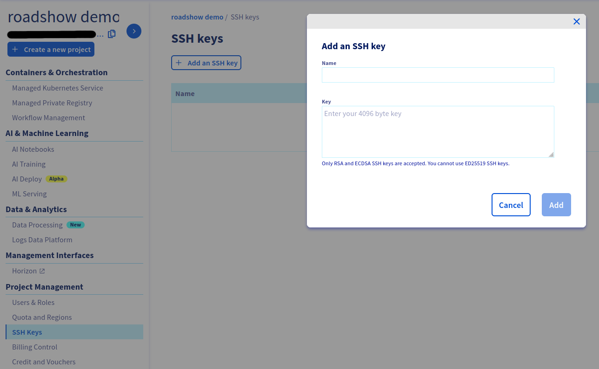

# Ustawianie środowiska

W tej sekcji przygotujemy podstawowe środowisko do pracy

## 1. Stworzenie folderu roboczego

=== "Linux, MacOS"
    ```code
    mkdir ~/roadshow-workspace
    cd ~/roadshow-workspace
    ```

=== "Windows"

    Utworzyć na pulpicie folder roadshow-workspace
    


## 2. Stworzenie pary kluczy SSH

Będziemy tworzyć parę kluczy typu ED25519 dla zgodności z nowymi systemami operacyjnymi.

=== "Linux, MacOS"
    Wykorzystamy polecenie `ssh-keygen` z OpenSSH

    ```code
    ssh-keygen -t ed25519 -f ~/roadshow-workspace/key
    ```

=== "Windows"
    Wykorzystamy program `puttygen.exe` który można pobrać z oficjalnej strony projektu: [https://www.chiark.greenend.org.uk/~sgtatham/putty/latest.html](https://www.chiark.greenend.org.uk/~sgtatham/putty/latest.html){:target="_blank"}

    1. Wygeneruj parę kluczy SSH
    
    2. zapisz klucz publiczny do katalogu roboczego
    
    
    3. zapisz klucz prywatny bez hasła do katalogu roboczego
    
    

## 3. Odczytanie klucza publicznego

Najpierw musimy odczytać część publiczną klucza SSH.

=== "Linux, MacOS"
    ```code
    cat ~/roadshow-workspace/key.pub
    ```
    Należy skopiować do schowka cały ciąg znaków `ssh-ed25519 KEEEY user@host`. To jest nasz klucz publiczny.

=== "Windows"
    W programie `puttygen.exe` należy przez przycisk `Load` wczytać plik `priv` z folderu `roadshow-workspace`.

    Następnie trzeba skopiować cały ciąg znaków z okienka `Public key for pasting into OpenSSH authorized_keys file`. To jest nasz klucz publiczny.

    

## 4. Dodanie klucza do Managera

Należy wejść w Managera w zakładkę Public Cloud.  
Wybrać swój projekt i w sekcji Project Management wybrać SSH Keys.

Następnie należy klikąć na Dodaj klucz SSH i podać nazwę i wkleić część publiczną klucza



Jeśli zakończyłeś podstawową konfigurajcę środowiska to możesz przejść do kolejnego rozdziału