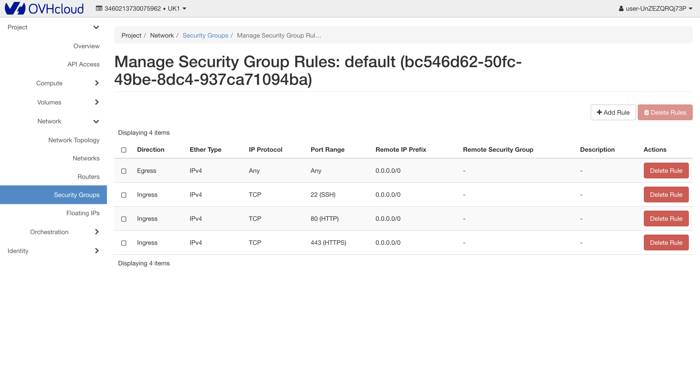

# Horizon

## 1. Utworzenie użytkownika Openstack
1. Przechodzimy do "Project Management -> Users & Roles"
1. Tworzymy użytkownika z uprawnieniami Administratora
1. Kopiujemy hasło
!!! warning
    Hasło jest wyświetlane tylko raz, dlatego proszę je zapisać

## 2. Obsługa panelu Horizon
1. Przechodzimy do panelu klienta [Horizon](https://horizon.cloud.ovh.net/auth/login/)
1. Korzystając z loginu oraz hasła z punktu 1 logujemy się do panelu
!!! note
    Login powinien wyglądać następująco: user-XXXXXXXXX

## 3. Security Groups
1. Sprawdzamy jakie security groupy są używane przez instancje. Aby to zrobić
   przechodzimy do zakładki "Compute -> Instances". Następnie w górnym panelu
   wybieramy odpowiedni region.
   

    !!! note
        Wszystkie instancje na początku korzystają z domyślnych ustawień, więc
        pozwalają na każdy rodzaj ruchu sieciowego.

1. Przechodzimy do zakładki "Network -> Security Groups" ([https://horizon.cloud.ovh.net/project/security_groups/](https://horizon.cloud.ovh.net/project/security_groups/)) i klikamy "Manage Rules"
1. Modyfikujemy domyślne reguły tak, żeby nie zostały żadne reguły dotyczące IPv4
   (jeżeli nie mamy zamiaru używać IPv6 można powiązane z nimi grupy również
   usunąć)
   
1. Sprawdzamy połączenie do instancji
1. Dodajemy nowe zasady dotyczące security group, aby pozwolić na ruch po
   podstawowych protokołach: SSH, HTTPS, HTTP
   
1. Ponownie sprawdzamy połączenie
1. (Opcjonalnie) Możemy sprawdzić czy nasz kontener z serwisem Nginx jeszcze
   działa
