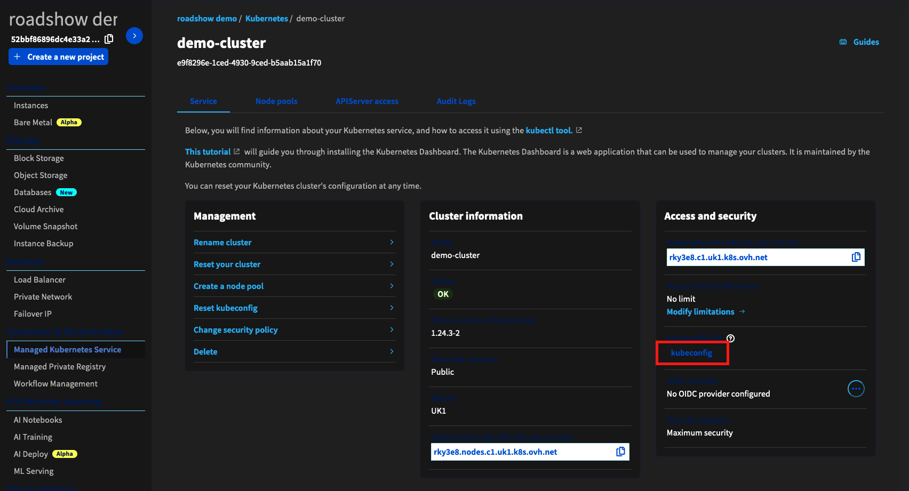
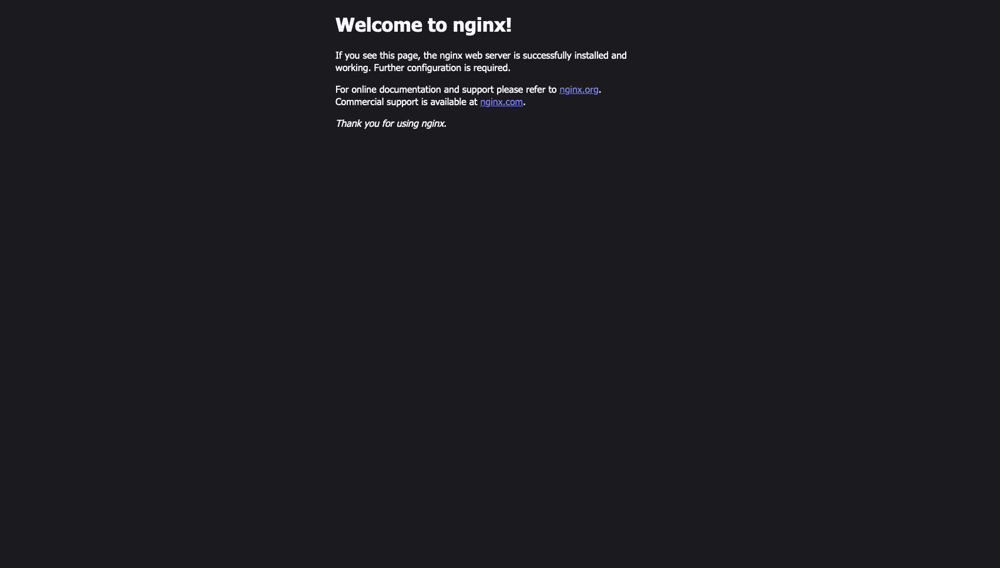

# Managed Kubernetes Service

## 1. Utworzenie małego klastra Kubernetes (3 węzły)

## 2. Instalacja narzędzia kubectl - [instrukcja](https://kubernetes.io/docs/tasks/tools/install-kubectl-linux/#install-kubectl-binary-with-curl-on-linux)

## 3. Stworzenie połączenia z klastrem
1. Pobieramy plik kubeconfig z panelu OVHcloud

1. Kopiujemy plik do instancji

    === "Linux, MacOS"
        ```code
        scp -i ~/roadshow-workspace/key kubeconfig.yml ubuntu@<public_ip>:~/
        ```

    === "Windows"
        Kopiujemy zawartość pliku przy użyciu schowka do pliku ~/kubeconfig.yml na instancji.

1. Używamy konfiguracji do połączenia z klastrem
```code
export KUBECONFIG=~/kubeconfig.yml
```

## 4. Stworzenie nowego serwisu
1. Listujemy węzły klastra
```code
kubectl get nodes
```

1. Tworzymy Poda z obrazem serwera Nginx
```code
kubectl run demo-nginx --image=nginx --port 80
```

1. Publikujemy stronę w Internecie
```code
kubectl expose pod demo-nginx --type=LoadBalancer
```

1. Szukamy serwisu LoadBalancer stworzonego dla naszego Poda
```code
kubectl get service demo-nginx
```

1. Sprawdzamy czy strona jest dostępna w Internecie

