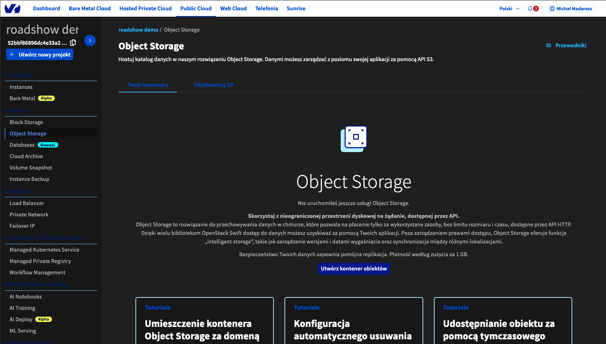
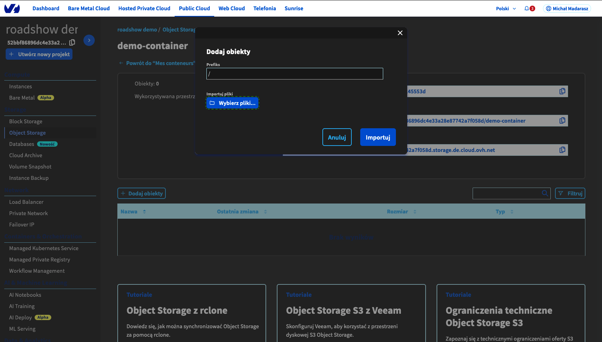
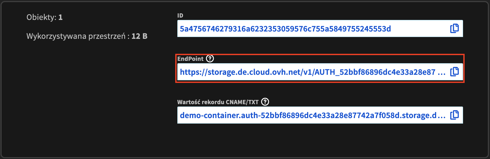

# Swift

## 1. Utworzenie publicznego bucketu/kontenera S3 o nazwie demo-container w panelu OVHcloud


## 2. Wysłanie pliku
1. Utworzenie pliku file.txt z tekstem `hello world` w folderze roadshow-workspace
1. Wysłanie pliku do stworzonego kontenera

1. Sprawdzenie, że plik istnieje w danym kontenerze w przeglądarce.
!!! note
    Plik będzie dostępny pod adresem który ma strukturę: `<endpoint>/file.txt`


## 3. Pobranie pliku
Używamy tego samego adresu URL do ściągnięcia pliku na instancję

```code
curl <endpoint>/file.txt > ~/file.txt
```

```code
cat ~/file.txt
```

## 4. Połączenie do bucketu z poziomu klienta
1. Pobranie i instalacja klienta MinIO: [https://min.io/docs/minio/linux/reference/minio-mc.html#install-mc](https://min.io/docs/minio/linux/reference/minio-mc.html#install-mc)
1. Skonfigurowanie klienta tak, żeby był połączony do naszego Object
   Storage.
   ```code
   mc alias set demo <endpoint> <accessKey> <secretKey>
   ```
1. Wylistowanie istniejących bucketów
    ```code
    mc ls demo
    ```
1. Wylistowanie obiektów z kontenera/bucketu
    ```code
    mc ls demo/demo-container
    ```
1. Pobranie obiektu z kontenera
    ```code
    mc cp demo/demo-container/file.txt ~/
    ```
    ```code
    cat ~/file.txt
    ```
