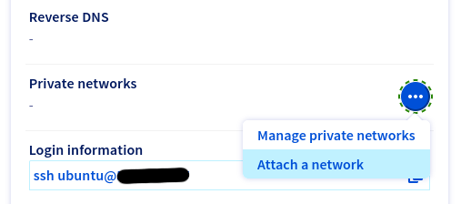

# vRack

## 1. Utworzenie sieci vRack

Należy w Managerze w sekcji Network kliknąć na Private Network.

Pokaże się informacja że projekt Public Cloud nie ma utworzonych jeszcze żadnych sieci vRack, więc należy utworzyć nową sieć klikając na przycisk **Create vRack** i potwierdzając operację w okienku popup.

## 2. Dodanie nowej sieci vRack

Po utworzeniu nowej sieci vRack należy dodać nową sieć prywatną. Należy kliknąć na przycisk **Add Private Network**.

Address distribution: ustawić jako DHCP.

Region: najlepiej wybrać wszystkie.

Nazwa: dowolna

## 3. Dodanie sieci prywatnej do VMki

W sekcji Compute należy kliknąć na Instances.

Następnie należy kliknąć na nazwę instancji którą chcemy edytować.

Po prawej stronie w kolumnie *Network* w sekcji **Private networks** pod przyciskiem z trzema kropkami wybrać **Attach a network**.



## 4. Podniesienie interfejsu vRack

Aby zobaczyć wszystkie interfejsy sieciowe na VMce należy wykonać polecenie:

```
ip link
```

Aby podnieść interfejs vRack i uzyskać na nim adres IP przez DHCP:

```
sudo dhclient ens7
```

Aby zmiany zostały zachowane po rebootcie trzeba będzie je dodać do konfiguracji sieciowej w `/etc/netplan/`.